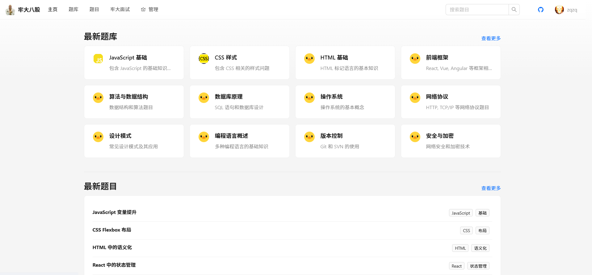
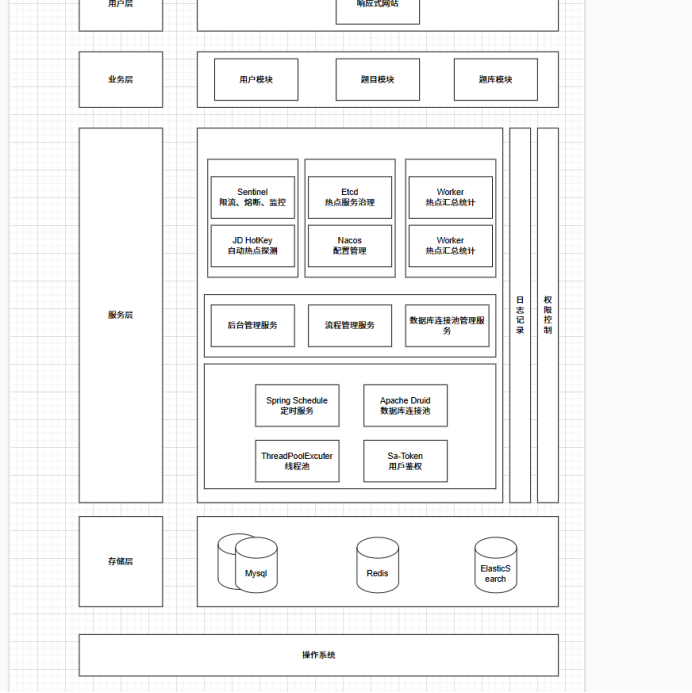

# 牢大八股
线上地址：别急，先空着  
前端地址：

## 技术栈： 
SpringBoot +  Maven + Mybatis-Plus + Mysql + Redis + ElasticSearch + HotKey + Redisson + Druid + Sa-Token + Sentinel + Nacos 
## 项目介绍：
如果像完整的应用项目的所有功能，需要使用nacos ,sentinel(还需要配置启动时的参数),etcd,hotkey,mysql,redis等服务,
该项目是一个主要面向程序员面试时候的刷题网站，在网站中统计了各个程序员面试时被拷打的问题，我们也对问题进行了分类处理（如计网，os，java，mysql，redis等大类，后续上线之后会完善），然后在题目中有相应的问题以及供参考的回答   
## 项目背景
取的名字是因为：这个八股文很坐牢，然后我又是一个火影玩家，俗称火批，然后前面坐牢的牢，就让我想到了牢大，也就是雷影，所以我就用他作为系统名字以及系统图标  
这是我大四专项设计时做出的系统。为什么要做这个系统呢？我哪来的灵感呢？
步入整体，首先，我是一名从事后端开发的同学，然后在我面试了多次之后，我发现不同面试官都会问到很多大差不差的东西，俗称八股文。 在面试前，我一般都会去牛客上去搜集这些八股文，但是吧，我发现虽然很多人在牛客上发自己的面经，但是这些面经没有答案，也很零散，不太方便去背，所以我在想我专项设计的时候就想做一个统计这些八股文的网站，后续把他部署在自己实验室的服务器上，上线以供实验室的同门甚至学校的学生来使用。
## 系统的功能
- 仅供所有用户（包括管理员）使用的功能：
    - 用户注册与登录
    - 用于查看题目与题库功能
    - 用户每日刷题日历
- 供管理员使用的功能：
    - 题目的增删改查
    - 题库的增删改查
    - 用户管理
    - 题目题库的关联  

你没听错，就这些基础的功能，这个时候有人就问了，zqzq，你这点功能就能当你的专项设计项目？  
zq：当然不是啦，我还做了提高系统性能以及安全相关的操作，如：  
- 性能：
   - 使用ES来实现题目的分词搜索，优化题目的搜索功能
   - 使用线程池以及Druid数据库连接池来优化批量操作功能
   - 使用hotkey自动缓存热门题目
- 安全
   - 使用sentinel对系统的流量控制以及熔断
   - 使用nacos动态ip黑名单过滤
   - 使用SaToken实现同端登录冲突检测以及权限校验
   - 使用redis实验反爬虫策略，对恶意爬虫账号进行强制下线甚至封号处理    
  
系统架构：

现在能想起来的操作就这么多，然后也欢迎大家拿我的项目做毕设或者一些课设（用这个项目交应该绰绰有余），如果对于这个项目有什么不懂得地方或者需要我帮忙配置相关环境以及运行代码的可以邮箱私我(小额收费): 2397873741@qq.com  
如果我的项目对您有帮助的话，能不能请我喝一杯奶茶或者请我吃一顿简单的早餐鼓励一下我，你的鼓励是我前进的动力！后续我也会提交自己的其他代码，欢迎大家支持

  

